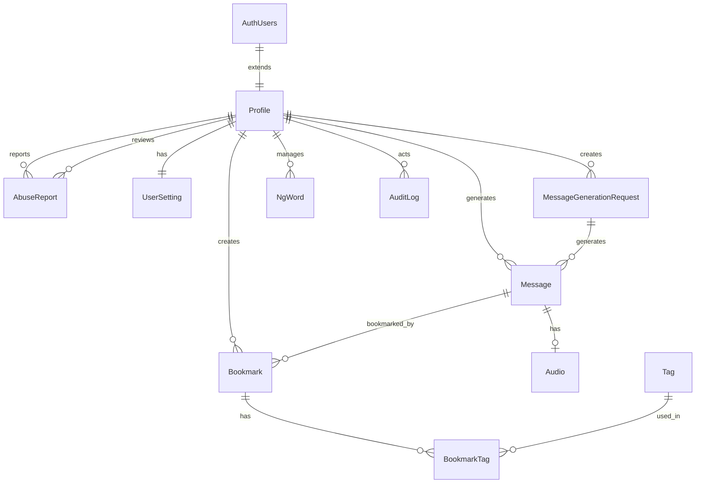

# DB設計書

## 1. はじめに

### 1.1 目的
本設計書は、英語学習チャットアプリケーションのデータベース設計を定義する。要件定義書に基づき、Supabase（PostgreSQL）を使用したリレーショナルデータベースの物理設計を記載する。

### 1.2 設計方針
- **DBMS**: Supabase (PostgreSQL 15以上)
- **認証**: Supabase Auth（auth.usersテーブルを使用）
- **ストレージ**: Supabase Storage（音声ファイル保存）
- **文字コード**: UTF-8
- **タイムゾーン**: UTC（アプリケーション層でローカル時間に変換）
- **命名規則**: スネークケース（snake_case）
- **ID生成**: UUID v4（主キー、auth.uid()を使用）、シーケンス（補助キー）
- **論理削除**: 削除フラグ（deleted_at）によるソフトデリート
- **監査**: created_at, updated_at, deleted_at を全テーブルに付与
- **セキュリティ**: Row Level Security (RLS) を全テーブルに適用
- **リアルタイム**: Supabase Realtime機能を活用（オプション）

### 1.3 用語
- **バブル**: 1件の学習メッセージ（テキスト＋音声再生＋ブックマークUI）
- **メッセージ**: AIが生成した学習テキスト
- **音声**: TTSで生成された発音音声ファイル
- **ブックマーク**: 学習メッセージを後学習用に保存したレコード
- **タグ**: ブックマークに付与する分類用のラベル

---

## 2. ER図（概念モデル）



---

## 3. テーブル一覧

| テーブル名 | 説明 | 主キー | 行数見積（初期） | RLS |
|---------|------|--------|----------------|-----|
| profiles | ユーザープロフィール（auth.users拡張） | id (UUID) | 10,000 | ✓ |
| messages | AI生成メッセージ | id (UUID) | 180,000/月 | ✓ |
| audios | 音声ファイル情報 | id (UUID) | 180,000/月 | ✓ |
| bookmarks | ブックマーク | id (UUID) | 50,000 | ✓ |
| tags | タグマスタ | id (UUID) | 500 | ✓ |
| bookmark_tags | ブックマーク-タグ関連 | id (BIGSERIAL) | 100,000 | ✓ |
| abuse_reports | 通報情報 | id (UUID) | 100 | ✓ |
| ng_words | NG語辞書 | id (UUID) | 1,000 | ✓ |
| user_settings | ユーザー設定 | user_id (UUID) | 10,000 | ✓ |
| audit_logs | 監査ログ | id (BIGSERIAL) | 1,000,000/月 | ✓ |
| message_generation_requests | メッセージ生成リクエスト履歴 | id (UUID) | 60,000/月 | ✓ |

**注意**: 
- `auth.users`はSupabaseが自動管理する認証テーブル（本設計書では定義しない）
- `profiles`テーブルは`auth.users`を拡張する形で定義

---

## 4. テーブル定義

### 4.1 profiles（ユーザープロフィール）

Supabaseの`auth.users`テーブルを拡張するプロフィールテーブル。認証情報は`auth.users`で管理。

| カラム名 | データ型 | 制約 | 説明 |
|---------|---------|------|------|
| id | UUID | PK, FK(auth.users.id), NOT NULL | ユーザーID（auth.users.idと一致） |
| locale | VARCHAR(10) | NOT NULL, DEFAULT 'ja-JP' | ロケール（例: ja-JP, en-US） |
| role | VARCHAR(20) | NOT NULL, DEFAULT 'user' | ロール（user, admin） |
| is_active | BOOLEAN | NOT NULL, DEFAULT true | アクティブフラグ |
| avatar_url | TEXT | NULL | アバター画像URL（Supabase Storage） |
| created_at | TIMESTAMP WITH TIME ZONE | NOT NULL, DEFAULT now() | 作成日時 |
| updated_at | TIMESTAMP WITH TIME ZONE | NOT NULL, DEFAULT now() | 更新日時 |
| deleted_at | TIMESTAMP WITH TIME ZONE | NULL | 削除日時（論理削除） |

**インデックス**:
- `idx_profiles_role` ON profiles(role) WHERE deleted_at IS NULL
- `idx_profiles_created_at` ON profiles(created_at) WHERE deleted_at IS NULL

**制約**:
- `chk_profiles_role` CHECK (role IN ('user', 'admin'))

**トリガー**:
- `updated_at`を自動更新するトリガーを設定

**RLSポリシー**:
- **SELECT**: 自分のプロフィールは全員閲覧可能、他ユーザーは基本情報のみ閲覧可能
- **UPDATE**: 自分のプロフィールのみ更新可能（管理者は全更新可能）
- **INSERT**: 認証済みユーザーは自分のプロフィールのみ作成可能
- **DELETE**: 管理者のみ削除可能（論理削除）

**説明**:
- `id`は`auth.users.id`と一致（Supabase AuthのユーザーIDを使用）
- メールアドレス等の認証情報は`auth.users`で管理（PII最小化）
- `role`はRBACで使用（カスタムクレームとして`auth.users.raw_user_meta_data`にも保存可能）
- `is_active=false`で凍結ユーザーを管理

---

### 4.2 messages（メッセージ）

AIが生成した学習メッセージ（バブル）を管理するテーブル。

| カラム名 | データ型 | 制約 | 説明 |
|---------|---------|------|------|
| id | UUID | PK, NOT NULL, DEFAULT gen_random_uuid() | メッセージID |
| user_id | UUID | FK(profiles.id), NOT NULL | 生成リクエストしたユーザーID |
| text | TEXT | NOT NULL | メッセージ本文（英語テキスト） |
| topic | VARCHAR(500) | NOT NULL | 入力されたテーマ/トピック |
| level | VARCHAR(20) | NULL | 難易度レベル（A1, A2, B1, B2, C1, C2等） |
| request_id | UUID | FK(message_generation_requests.id), NULL | 生成リクエストID（同一リクエストで3件生成） |
| sequence | SMALLINT | NOT NULL, DEFAULT 1 | 同一リクエスト内の順序（1-3） |
| provider | VARCHAR(50) | NOT NULL | LLMプロバイダ名（例: openai, anthropic） |
| provider_meta | JSONB | NULL | プロバイダ固有のメタデータ |
| word_count | INTEGER | NULL | 単語数 |
| character_count | INTEGER | NULL | 文字数 |
| created_at | TIMESTAMP WITH TIME ZONE | NOT NULL, DEFAULT now() | 作成日時 |
| updated_at | TIMESTAMP WITH TIME ZONE | NOT NULL, DEFAULT now() | 更新日時 |
| deleted_at | TIMESTAMP WITH TIME ZONE | NULL | 削除日時（論理削除） |

**インデックス**:
- `idx_messages_user_id` ON messages(user_id, created_at DESC) WHERE deleted_at IS NULL
- `idx_messages_request_id` ON messages(request_id)
- `idx_messages_topic` ON messages USING gin(to_tsvector('english', topic))
- `idx_messages_text` ON messages USING gin(to_tsvector('english', text))
- `idx_messages_created_at` ON messages(created_at DESC) WHERE deleted_at IS NULL

**制約**:
- `chk_messages_sequence` CHECK (sequence >= 1 AND sequence <= 3)
- `chk_messages_text_length` CHECK (char_length(text) >= 1 AND char_length(text) <= 2000)
- `chk_messages_topic_length` CHECK (char_length(topic) >= 1 AND char_length(topic) <= 500)

**トリガー**:
- `updated_at`を自動更新するトリガーを設定

**RLSポリシー**:
- **SELECT**: 自分のメッセージは閲覧可能、他ユーザーのメッセージは公開設定時のみ閲覧可能
- **INSERT**: 認証済みユーザーは自分のメッセージのみ作成可能
- **UPDATE**: 自分のメッセージのみ更新可能（管理者は全更新可能）
- **DELETE**: 自分のメッセージのみ削除可能（管理者は全削除可能）

**説明**:
- 1リクエストで3件生成されるため、request_idとsequenceでグループ化
- 全文検索用にGINインデックスを設定
- provider_metaにLLM応答の生データやプロンプト情報を保存可能

---

### 4.3 audios（音声）

TTSで生成された音声ファイルのメタデータを管理するテーブル。音声ファイル本体はSupabase Storageに保存。

| カラム名 | データ型 | 制約 | 説明 |
|---------|---------|------|------|
| id | UUID | PK, NOT NULL, DEFAULT gen_random_uuid() | 音声ID |
| message_id | UUID | FK(messages.id), UNIQUE, NOT NULL | メッセージID（1対1） |
| storage_path | TEXT | NOT NULL | Supabase Storageのパス（例: audios/{message_id}.mp3） |
| public_url | TEXT | NULL | 公開URL（Supabase Storageの公開URL） |
| voice | VARCHAR(50) | NOT NULL | 音声種別（例: en-US-Neural2-A, en-GB-Neural2-B） |
| speed | DECIMAL(3,2) | NOT NULL, DEFAULT 1.00 | 再生速度（0.5-2.0） |
| format | VARCHAR(10) | NOT NULL, DEFAULT 'mp3' | 音声フォーマット（mp3, wav, ogg） |
| duration_sec | DECIMAL(6,2) | NULL | 音声長（秒） |
| file_size_bytes | BIGINT | NULL | ファイルサイズ（バイト） |
| hash | VARCHAR(64) | UNIQUE, NOT NULL | 音声ファイルのSHA-256ハッシュ（重複検出用） |
| provider | VARCHAR(50) | NOT NULL | TTSプロバイダ名（例: aws-polly, google-tts） |
| provider_meta | JSONB | NULL | プロバイダ固有のメタデータ |
| created_at | TIMESTAMP WITH TIME ZONE | NOT NULL, DEFAULT now() | 作成日時 |
| updated_at | TIMESTAMP WITH TIME ZONE | NOT NULL, DEFAULT now() | 更新日時 |
| deleted_at | TIMESTAMP WITH TIME ZONE | NULL | 削除日時（論理削除） |

**インデックス**:
- `idx_audios_message_id` ON audios(message_id) WHERE deleted_at IS NULL
- `idx_audios_hash` ON audios(hash)
- `idx_audios_voice` ON audios(voice)
- `idx_audios_storage_path` ON audios(storage_path)

**制約**:
- `chk_audios_speed` CHECK (speed >= 0.5 AND speed <= 2.0)
- `chk_audios_format` CHECK (format IN ('mp3', 'wav', 'ogg', 'm4a'))

**トリガー**:
- `updated_at`を自動更新するトリガーを設定

**RLSポリシー**:
- **SELECT**: 認証済みユーザーは全閲覧可能（音声は公開リソース）
- **INSERT**: 認証済みユーザーは作成可能
- **UPDATE**: 管理者のみ更新可能
- **DELETE**: 管理者のみ削除可能

**Supabase Storage設定**:
- **バケット名**: `audios`
- **公開設定**: 認証済みユーザーは読み取り可能
- **ファイル命名**: `{message_id}.{format}`

**説明**:
- hashで同一音声の重複生成を防止（コスト削減）
- message_idはUNIQUE制約で1メッセージ1音声を保証
- 音声ファイル本体はSupabase Storageに保存
- public_urlはSupabase Storageの公開URLを自動生成

---

### 4.4 bookmarks（ブックマーク）

ユーザーが保存した学習メッセージのブックマークを管理するテーブル。

| カラム名 | データ型 | 制約 | 説明 |
|---------|---------|------|------|
| id | UUID | PK, NOT NULL, DEFAULT gen_random_uuid() | ブックマークID |
| user_id | UUID | FK(profiles.id), NOT NULL | ユーザーID |
| message_id | UUID | FK(messages.id), NOT NULL | メッセージID |
| notes | TEXT | NULL | ユーザーが追加したメモ |
| is_learned | BOOLEAN | NOT NULL, DEFAULT false | 学習済みフラグ |
| learned_at | TIMESTAMP WITH TIME ZONE | NULL | 学習済み日時 |
| created_at | TIMESTAMP WITH TIME ZONE | NOT NULL, DEFAULT now() | 作成日時 |
| updated_at | TIMESTAMP WITH TIME ZONE | NOT NULL, DEFAULT now() | 更新日時 |
| deleted_at | TIMESTAMP WITH TIME ZONE | NULL | 削除日時（論理削除） |

**インデックス**:
- `idx_bookmarks_user_id` ON bookmarks(user_id, created_at DESC) WHERE deleted_at IS NULL
- `idx_bookmarks_message_id` ON bookmarks(message_id) WHERE deleted_at IS NULL
- `idx_bookmarks_user_learned` ON bookmarks(user_id, is_learned, created_at DESC) WHERE deleted_at IS NULL
- `idx_bookmarks_user_message_unique` ON bookmarks(user_id, message_id) WHERE deleted_at IS NULL

**制約**:
- `uk_bookmarks_user_message` UNIQUE (user_id, message_id) WHERE deleted_at IS NULL
- `chk_bookmarks_learned` CHECK ((is_learned = false AND learned_at IS NULL) OR (is_learned = true AND learned_at IS NOT NULL))

**トリガー**:
- `updated_at`を自動更新するトリガーを設定

**RLSポリシー**:
- **SELECT**: 自分のブックマークのみ閲覧可能
- **INSERT**: 認証済みユーザーは自分のブックマークのみ作成可能
- **UPDATE**: 自分のブックマークのみ更新可能
- **DELETE**: 自分のブックマークのみ削除可能（確認モーダル必須）

**説明**:
- ユーザーとメッセージの組み合わせで重複禁止（UNIQUE制約）
- 論理削除時はUNIQUE制約から除外（WHERE句）
- is_learnedで復習進捗を管理

---

### 4.5 tags（タグマスタ）

ブックマークに付与するタグのマスタテーブル。

| カラム名 | データ型 | 制約 | 説明 |
|---------|---------|------|------|
| id | UUID | PK, NOT NULL, DEFAULT gen_random_uuid() | タグID |
| name | VARCHAR(50) | UNIQUE, NOT NULL | タグ名（例: grammar, vocabulary, business） |
| description | VARCHAR(255) | NULL | タグ説明 |
| color | VARCHAR(7) | NULL | 表示色（HEX、例: #FF5733） |
| is_system | BOOLEAN | NOT NULL, DEFAULT false | システム定義タグフラグ |
| created_at | TIMESTAMP WITH TIME ZONE | NOT NULL, DEFAULT now() | 作成日時 |
| updated_at | TIMESTAMP WITH TIME ZONE | NOT NULL, DEFAULT now() | 更新日時 |
| deleted_at | TIMESTAMP WITH TIME ZONE | NULL | 削除日時（論理削除） |

**インデックス**:
- `idx_tags_name` ON tags(name) WHERE deleted_at IS NULL

**制約**:
- `chk_tags_name_length` CHECK (char_length(name) >= 1 AND char_length(name) <= 50)
- `chk_tags_color_format` CHECK (color IS NULL OR color ~* '^#[0-9A-Fa-f]{6}$')

**トリガー**:
- `updated_at`を自動更新するトリガーを設定

**RLSポリシー**:
- **SELECT**: 認証済みユーザーは全閲覧可能（タグは共有リソース）
- **INSERT**: 管理者のみ作成可能
- **UPDATE**: 管理者のみ更新可能（is_system=trueは更新不可）
- **DELETE**: 管理者のみ削除可能（is_system=trueは削除不可）

**説明**:
- タグは共有リソース（全ユーザー共通）
- is_system=trueのタグは削除不可（アプリケーション層で制御）

---

### 4.6 bookmark_tags（ブックマーク-タグ関連）

ブックマークとタグの多対多関連を管理するテーブル。

| カラム名 | データ型 | 制約 | 説明 |
|---------|---------|------|------|
| id | BIGSERIAL | PK, NOT NULL | 関連ID |
| bookmark_id | UUID | FK(bookmarks.id), NOT NULL | ブックマークID |
| tag_id | UUID | FK(tags.id), NOT NULL | タグID |
| created_at | TIMESTAMP WITH TIME ZONE | NOT NULL, DEFAULT now() | 作成日時 |

**インデックス**:
- `idx_bookmark_tags_bookmark_id` ON bookmark_tags(bookmark_id)
- `idx_bookmark_tags_tag_id` ON bookmark_tags(tag_id)
- `idx_bookmark_tags_unique` ON bookmark_tags(bookmark_id, tag_id)

**制約**:
- `uk_bookmark_tags` UNIQUE (bookmark_id, tag_id)

**RLSポリシー**:
- **SELECT**: 自分のブックマークのタグのみ閲覧可能
- **INSERT**: 自分のブックマークのタグのみ作成可能
- **UPDATE**: 自分のブックマークのタグのみ更新可能
- **DELETE**: 自分のブックマークのタグのみ削除可能

**説明**:
- 1ブックマークに複数タグを付与可能
- 重複防止のためUNIQUE制約を設定

---

### 4.7 abuse_reports（通報）

不適切コンテンツの通報情報を管理するテーブル。

| カラム名 | データ型 | 制約 | 説明 |
|---------|---------|------|------|
| id | UUID | PK, NOT NULL, DEFAULT gen_random_uuid() | 通報ID |
| reporter_id | UUID | FK(profiles.id), NOT NULL | 通報者ユーザーID |
| target_type | VARCHAR(20) | NOT NULL | 対象タイプ（message, user, bookmark） |
| target_id | UUID | NOT NULL | 対象ID |
| reason | VARCHAR(50) | NOT NULL | 通報理由（spam, inappropriate, copyright, other） |
| description | TEXT | NULL | 通報詳細説明 |
| status | VARCHAR(20) | NOT NULL, DEFAULT 'pending' | ステータス（pending, reviewing, resolved, dismissed） |
| reviewed_by | UUID | FK(profiles.id), NULL | 審査担当者ID（管理者） |
| reviewed_at | TIMESTAMP WITH TIME ZONE | NULL | 審査日時 |
| review_notes | TEXT | NULL | 審査メモ |
| created_at | TIMESTAMP WITH TIME ZONE | NOT NULL, DEFAULT now() | 作成日時 |
| updated_at | TIMESTAMP WITH TIME ZONE | NOT NULL, DEFAULT now() | 更新日時 |
| deleted_at | TIMESTAMP WITH TIME ZONE | NULL | 削除日時（論理削除） |

**インデックス**:
- `idx_abuse_reports_status` ON abuse_reports(status, created_at DESC) WHERE deleted_at IS NULL
- `idx_abuse_reports_target` ON abuse_reports(target_type, target_id) WHERE deleted_at IS NULL
- `idx_abuse_reports_reporter` ON abuse_reports(reporter_id, created_at DESC) WHERE deleted_at IS NULL

**制約**:
- `chk_abuse_reports_target_type` CHECK (target_type IN ('message', 'user', 'bookmark'))
- `chk_abuse_reports_reason` CHECK (reason IN ('spam', 'inappropriate', 'copyright', 'other'))
- `chk_abuse_reports_status` CHECK (status IN ('pending', 'reviewing', 'resolved', 'dismissed'))
- `chk_abuse_reports_reviewed` CHECK ((status IN ('pending', 'reviewing') AND reviewed_by IS NULL) OR (status IN ('resolved', 'dismissed') AND reviewed_by IS NOT NULL))

**トリガー**:
- `updated_at`を自動更新するトリガーを設定

**RLSポリシー**:
- **SELECT**: 自分の通報は閲覧可能、管理者は全閲覧可能
- **INSERT**: 認証済みユーザーは通報作成可能
- **UPDATE**: 管理者のみ更新可能
- **DELETE**: 管理者のみ削除可能

**説明**:
- 管理者が審査し、statusを更新
- target_typeとtarget_idで対象を特定

---

### 4.8 ng_words（NG語辞書）

不適切語句の辞書を管理するテーブル（管理者用）。

| カラム名 | データ型 | 制約 | 説明 |
|---------|---------|------|------|
| id | UUID | PK, NOT NULL, DEFAULT gen_random_uuid() | NG語ID |
| word | VARCHAR(100) | UNIQUE, NOT NULL | NG語句（大文字小文字区別なし） |
| word_lower | VARCHAR(100) | NOT NULL | 小文字正規化版（検索用） |
| category | VARCHAR(20) | NOT NULL | カテゴリ（profanity, hate_speech, spam, other） |
| action | VARCHAR(20) | NOT NULL, DEFAULT 'replace' | アクション（replace, reject） |
| replacement | VARCHAR(100) | NULL | 置換語句（action=replace時） |
| created_by | UUID | FK(profiles.id), NOT NULL | 作成者ID（管理者） |
| created_at | TIMESTAMP WITH TIME ZONE | NOT NULL, DEFAULT now() | 作成日時 |
| updated_at | TIMESTAMP WITH TIME ZONE | NOT NULL, DEFAULT now() | 更新日時 |
| deleted_at | TIMESTAMP WITH TIME ZONE | NULL | 削除日時（論理削除） |

**インデックス**:
- `idx_ng_words_word_lower` ON ng_words(word_lower) WHERE deleted_at IS NULL
- `idx_ng_words_category` ON ng_words(category) WHERE deleted_at IS NULL

**制約**:
- `chk_ng_words_word_length` CHECK (char_length(word) >= 1 AND char_length(word) <= 100)
- `chk_ng_words_category` CHECK (category IN ('profanity', 'hate_speech', 'spam', 'other'))
- `chk_ng_words_action` CHECK (action IN ('replace', 'reject'))
- `chk_ng_words_replacement` CHECK ((action = 'replace' AND replacement IS NOT NULL) OR (action = 'reject'))

**トリガー**:
- `updated_at`を自動更新するトリガーを設定

**RLSポリシー**:
- **SELECT**: 管理者のみ閲覧可能（NG語リストは機密情報）
- **INSERT**: 管理者のみ作成可能
- **UPDATE**: 管理者のみ更新可能
- **DELETE**: 管理者のみ削除可能

**説明**:
- word_lowerで大文字小文字を区別せず検索
- action=replace時はreplacementで置換、reject時は生成拒否

---

### 4.9 user_settings（ユーザー設定）

ユーザーごとの設定情報を管理するテーブル。

| カラム名 | データ型 | 制約 | 説明 |
|---------|---------|------|------|
| user_id | UUID | PK, FK(profiles.id), NOT NULL | ユーザーID |
| audio_voice | VARCHAR(50) | NULL | デフォルト音声種別 |
| audio_speed | DECIMAL(3,2) | NOT NULL, DEFAULT 1.00 | デフォルト再生速度 |
| theme | VARCHAR(20) | NOT NULL, DEFAULT 'light' | テーマ（light, dark, auto） |
| language | VARCHAR(10) | NOT NULL, DEFAULT 'ja' | UI言語（ja, en） |
| notification_enabled | BOOLEAN | NOT NULL, DEFAULT true | 通知有効フラグ |
| created_at | TIMESTAMP WITH TIME ZONE | NOT NULL, DEFAULT now() | 作成日時 |
| updated_at | TIMESTAMP WITH TIME ZONE | NOT NULL, DEFAULT now() | 更新日時 |

**インデックス**:
- なし（PKで十分）

**制約**:
- `chk_user_settings_audio_speed` CHECK (audio_speed >= 0.5 AND audio_speed <= 2.0)
- `chk_user_settings_theme` CHECK (theme IN ('light', 'dark', 'auto'))
- `chk_user_settings_language` CHECK (language IN ('ja', 'en'))

**トリガー**:
- `updated_at`を自動更新するトリガーを設定

**RLSポリシー**:
- **SELECT**: 自分の設定のみ閲覧可能
- **INSERT**: 認証済みユーザーは自分の設定のみ作成可能
- **UPDATE**: 自分の設定のみ更新可能
- **DELETE**: 自分の設定のみ削除可能

**説明**:
- 1ユーザー1レコード（PK=user_id）
- デフォルト値はアプリケーション層で設定

---

### 4.10 audit_logs（監査ログ）

重要な操作の監査ログを記録するテーブル。

| カラム名 | データ型 | 制約 | 説明 |
|---------|---------|------|------|
| id | BIGSERIAL | PK, NOT NULL | ログID |
| actor_id | UUID | FK(profiles.id), NULL | 実行者ユーザーID（匿名時はNULL） |
| actor_type | VARCHAR(20) | NOT NULL | 実行者タイプ（user, system, admin） |
| action | VARCHAR(50) | NOT NULL | アクション（create_message, delete_bookmark, login, etc.） |
| target_type | VARCHAR(50) | NULL | 対象タイプ（message, bookmark, user, etc.） |
| target_id | UUID | NULL | 対象ID |
| ip_address | VARCHAR(45) | NULL | IPアドレス（IPv4/IPv6、末尾マスク済み） |
| user_agent | VARCHAR(500) | NULL | User-Agent |
| metadata | JSONB | NULL | 追加メタデータ |
| created_at | TIMESTAMP WITH TIME ZONE | NOT NULL, DEFAULT now() | 作成日時 |

**インデックス**:
- `idx_audit_logs_actor` ON audit_logs(actor_id, created_at DESC) WHERE actor_id IS NOT NULL
- `idx_audit_logs_action` ON audit_logs(action, created_at DESC)
- `idx_audit_logs_target` ON audit_logs(target_type, target_id) WHERE target_type IS NOT NULL
- `idx_audit_logs_created_at` ON audit_logs(created_at DESC)

**パーティショニング**:
- 90日を超えるログは別テーブルにアーカイブ（パーティショニングまたは定期削除）

**制約**:
- `chk_audit_logs_actor_type` CHECK (actor_type IN ('user', 'system', 'admin'))
- `chk_audit_logs_ip_format` CHECK (ip_address IS NULL OR ip_address ~ '^([0-9]{1,3}\.){3}[0-9]{1,3}$' OR ip_address ~ '^([0-9a-fA-F]{0,4}:){1,7}[0-9a-fA-F]{0,4}$')

**RLSポリシー**:
- **SELECT**: 管理者のみ閲覧可能（監査ログは機密情報）
- **INSERT**: システムのみ作成可能（アプリケーション層から直接挿入）
- **UPDATE**: 不可（監査ログは不変）
- **DELETE**: 管理者のみ削除可能（90日経過後のアーカイブ時）

**説明**:
- PII保護のため、IPアドレスは末尾をマスク（例: 192.168.1.XXX）
- 保持期間90日（要件定義書より）
- パーティショニングでパフォーマンスとアーカイブを両立

---

### 4.11 message_generation_requests（メッセージ生成リクエスト履歴）

メッセージ生成リクエストの履歴を管理するテーブル（FR-006: 履歴機能対応）。

| カラム名 | データ型 | 制約 | 説明 |
|---------|---------|------|------|
| id | UUID | PK, NOT NULL, DEFAULT gen_random_uuid() | リクエストID |
| user_id | UUID | FK(profiles.id), NOT NULL | ユーザーID |
| topic | VARCHAR(500) | NOT NULL | 入力テーマ |
| level | VARCHAR(20) | NULL | 指定難易度レベル |
| message_count | SMALLINT | NOT NULL, DEFAULT 3 | 生成メッセージ数（通常3） |
| status | VARCHAR(20) | NOT NULL, DEFAULT 'processing' | ステータス（processing, completed, failed, partial） |
| error_message | TEXT | NULL | エラーメッセージ（失敗時） |
| provider | VARCHAR(50) | NOT NULL | 使用LLMプロバイダ |
| processing_time_ms | INTEGER | NULL | 処理時間（ミリ秒） |
| created_at | TIMESTAMP WITH TIME ZONE | NOT NULL, DEFAULT now() | 作成日時 |
| completed_at | TIMESTAMP WITH TIME ZONE | NULL | 完了日時 |

**インデックス**:
- `idx_message_gen_req_user_id` ON message_generation_requests(user_id, created_at DESC)
- `idx_message_gen_req_status` ON message_generation_requests(status, created_at DESC)
- `idx_message_gen_req_created_at` ON message_generation_requests(created_at DESC)

**制約**:
- `chk_message_gen_req_message_count` CHECK (message_count >= 1 AND message_count <= 3)
- `chk_message_gen_req_status` CHECK (status IN ('processing', 'completed', 'failed', 'partial'))
- `chk_message_gen_req_topic_length` CHECK (char_length(topic) >= 1 AND char_length(topic) <= 500)

**RLSポリシー**:
- **SELECT**: 自分のリクエストのみ閲覧可能
- **INSERT**: 認証済みユーザーは自分のリクエストのみ作成可能
- **UPDATE**: システムのみ更新可能（ステータス更新）
- **DELETE**: 自分のリクエストのみ削除可能

**説明**:
- 1リクエストで複数メッセージ（通常3件）を生成
- status=partialはLLM失敗時の縮退対応
- 直近50件の履歴表示に対応（インデックス最適化）

---

## 5. 外部キー制約

| 親テーブル | 子テーブル | カラム | 削除時動作 |
|-----------|----------|--------|-----------|
| auth.users | profiles | id | CASCADE |
| profiles | messages | user_id | RESTRICT |
| profiles | bookmarks | user_id | CASCADE |
| profiles | user_settings | user_id | CASCADE |
| profiles | abuse_reports | reporter_id | RESTRICT |
| profiles | abuse_reports | reviewed_by | RESTRICT |
| profiles | ng_words | created_by | RESTRICT |
| profiles | audit_logs | actor_id | SET NULL |
| profiles | message_generation_requests | user_id | RESTRICT |
| messages | audios | message_id | CASCADE |
| messages | bookmarks | message_id | RESTRICT |
| message_generation_requests | messages | request_id | RESTRICT |
| bookmarks | bookmark_tags | bookmark_id | CASCADE |
| tags | bookmark_tags | tag_id | RESTRICT |

**削除時動作の説明**:
- **RESTRICT**: 参照されている場合は削除不可（データ整合性保護）
- **CASCADE**: 親削除時に子も削除（依存データの一括削除）
- **SET NULL**: 親削除時に子のFKをNULL化（監査ログなど）

**注意**: 
- `auth.users`はSupabaseが管理するテーブル。`auth.users`からユーザーが削除されると、`profiles`もCASCADEで削除される
- `profiles`が削除されると、関連するユーザーデータもCASCADEで削除される

---

## 6. インデックス設計方針

### 6.1 基本方針
- **主キー**: 自動的にB-treeインデックスが作成される
- **外部キー**: 参照整合性チェックのため、通常はインデックスを付与
- **検索条件**: WHERE句で頻繁に使用されるカラムにインデックス
- **ソート**: ORDER BYで使用されるカラムにインデックス
- **部分インデックス**: deleted_at IS NULL条件でアクティブレコードのみにインデックス

### 6.2 全文検索
- messagesテーブルのtext, topicカラムにGINインデックス（PostgreSQLの全文検索機能）
- 英語テキストの検索に対応

### 6.3 複合インデックス
- 複数カラムでの検索・ソートを考慮（例: user_id + created_at DESC）
- カバリングインデックスとしてSELECT対象カラムも含める検討

---

## 7. データ保持・アーカイブ方針

| テーブル | 保持期間 | アーカイブ方法 |
|---------|---------|---------------|
| users | 無期限（削除要求まで） | 論理削除 |
| messages | 無期限 | 論理削除 |
| audios | 無期限 | 論理削除（S3ファイルは別途管理） |
| bookmarks | 無期限（削除要求まで） | 論理削除 |
| tags | 無期限 | 論理削除 |
| abuse_reports | 1年 | 論理削除 |
| ng_words | 無期限 | 論理削除 |
| user_settings | 無期限 | 論理削除 |
| audit_logs | 90日 | パーティショニング/削除 |
| message_generation_requests | 1年 | パーティショニング/削除 |

**説明**:
- 論理削除（deleted_at）でデータを保持しつつ、通常クエリから除外
- audit_logsは90日を超えたらアーカイブテーブルへ移動または削除
- 集計データは1年保持（要件定義書より）

---

## 8. パフォーマンス考慮事項

### 8.1 想定クエリパターン

1. **メッセージ生成履歴取得（FR-006）**
   ```sql
   SELECT * FROM message_generation_requests 
   WHERE user_id = ? 
   ORDER BY created_at DESC 
   LIMIT 50;
   ```
   → `idx_message_gen_req_user_id`で最適化

2. **ブックマーク一覧・検索（FR-004）**
   ```sql
   SELECT b.*, m.text, m.topic, a.url 
   FROM bookmarks b
   JOIN messages m ON b.message_id = m.id
   LEFT JOIN audios a ON m.id = a.message_id
   WHERE b.user_id = ? AND b.deleted_at IS NULL
   ORDER BY b.created_at DESC
   LIMIT 20 OFFSET ?;
   ```
   → `idx_bookmarks_user_id`で最適化

3. **タグ検索**
   ```sql
   SELECT b.* FROM bookmarks b
   JOIN bookmark_tags bt ON b.id = bt.bookmark_id
   WHERE b.user_id = ? AND bt.tag_id = ? AND b.deleted_at IS NULL;
   ```
   → `idx_bookmark_tags_tag_id`で最適化

4. **全文検索（メッセージ）**
   ```sql
   SELECT * FROM messages 
   WHERE to_tsvector('english', text) @@ to_tsquery('english', ?)
   AND deleted_at IS NULL;
   ```
   → GINインデックスで最適化

### 8.2 パーティショニング検討
- **audit_logs**: 日付でパーティショニング（月次または四半期）
- **message_generation_requests**: 日付でパーティショニング（月次）

### 8.3 接続プール
- PgBouncerまたはアプリケーション層のコネクションプールを使用
- 同時接続数: 200（要件定義書のPeak同時接続数）

---

## 9. Supabase特有の機能・設定

### 9.1 Row Level Security (RLS)

全テーブルでRLSを有効化し、行レベルでのアクセス制御を実装。

**RLS有効化**:
```sql
ALTER TABLE profiles ENABLE ROW LEVEL SECURITY;
ALTER TABLE messages ENABLE ROW LEVEL SECURITY;
-- 全テーブルに適用
```

**ポリシー例（profiles）**:
```sql
-- 自分のプロフィールは閲覧可能
CREATE POLICY "Users can view own profile"
  ON profiles FOR SELECT
  USING (auth.uid() = id);

-- 自分のプロフィールは更新可能
CREATE POLICY "Users can update own profile"
  ON profiles FOR UPDATE
  USING (auth.uid() = id);
```

**ポリシー例（bookmarks）**:
```sql
-- 自分のブックマークのみ閲覧可能
CREATE POLICY "Users can view own bookmarks"
  ON bookmarks FOR SELECT
  USING (auth.uid() = user_id AND deleted_at IS NULL);

-- 自分のブックマークのみ作成可能
CREATE POLICY "Users can insert own bookmarks"
  ON bookmarks FOR INSERT
  WITH CHECK (auth.uid() = user_id);
```

### 9.2 トリガー（updated_at自動更新）

全テーブルの`updated_at`カラムを自動更新するトリガー関数。

```sql
-- トリガー関数の作成
CREATE OR REPLACE FUNCTION update_updated_at_column()
RETURNS TRIGGER AS $$
BEGIN
  NEW.updated_at = now();
  RETURN NEW;
END;
$$ LANGUAGE plpgsql;

-- 各テーブルにトリガーを設定
CREATE TRIGGER update_profiles_updated_at
  BEFORE UPDATE ON profiles
  FOR EACH ROW
  EXECUTE FUNCTION update_updated_at_column();

-- 他のテーブルにも同様に設定
```

### 9.3 Supabase Storage設定

**バケット構成**:

| バケット名 | 用途 | 公開設定 | ファイルサイズ制限 |
|-----------|------|---------|-------------------|
| audios | 音声ファイル | 認証済みユーザー読み取り | 10MB |
| avatars | アバター画像 | 公開読み取り | 2MB |

**Storageポリシー例（audios）**:
```sql
-- 認証済みユーザーは読み取り可能
CREATE POLICY "Authenticated users can read audios"
  ON storage.objects FOR SELECT
  USING (bucket_id = 'audios' AND auth.role() = 'authenticated');

-- 認証済みユーザーはアップロード可能
CREATE POLICY "Authenticated users can upload audios"
  ON storage.objects FOR INSERT
  WITH CHECK (bucket_id = 'audios' AND auth.role() = 'authenticated');
```

### 9.4 Supabase Functions（Edge Functions）

バックエンド処理用のEdge Functions（オプション）。

- **LLM呼び出し**: `/functions/generate-messages`
- **TTS生成**: `/functions/generate-audio`
- **NG語チェック**: `/functions/check-ng-words`

### 9.5 リアルタイム機能（オプション）

Supabase Realtimeを使用したリアルタイム更新（オプション）。

```sql
-- リアルタイムを有効化するテーブル
ALTER PUBLICATION supabase_realtime ADD TABLE messages;
ALTER PUBLICATION supabase_realtime ADD TABLE bookmarks;
```

**使用例**:
- メッセージ生成完了の通知
- ブックマーク追加の通知

### 9.6 データベース拡張機能

必要なPostgreSQL拡張機能を有効化。

```sql
-- UUID生成
CREATE EXTENSION IF NOT EXISTS "uuid-ossp";

-- 全文検索（既に有効）
-- PostgreSQL標準機能を使用

-- その他必要な拡張機能
```

---

## 10. セキュリティ考慮事項

### 10.1 データ暗号化
- **At-Rest**: Supabaseが自動的に暗号化（AES-256）
- **In-Transit**: TLS 1.2以上で接続（Supabaseが自動管理）

### 10.2 PII保護
- **認証情報**: `auth.users`で管理（Supabase Authが自動管理）
- **IPアドレス**: 監査ログで末尾マスク（192.168.1.XXX形式）
- **最小保持**: 必要最小限のPIIのみ保持（profilesテーブルには認証情報を保存しない）

### 10.3 アクセス制御
- **アプリケーション層**: RBACで権限管理（profiles.roleを使用）
- **データベース層**: RLS（Row Level Security）で行レベルアクセス制御
- **監査**: 全操作をaudit_logsに記録

### 10.4 Supabase Auth連携
- **認証**: Supabase Authを使用（OAuth2.1/OIDC対応）
- **セッション管理**: Supabaseが自動管理（JWTトークン）
- **カスタムクレーム**: `auth.users.raw_user_meta_data`にroleを保存可能

---

## 11. マイグレーション方針

### 11.1 スキーマバージョン管理
- **ツール**: Supabase CLI + SQLマイグレーション
- **命名規則**: `{timestamp}_{description}.sql`（例: `20240101000000_create_profiles.sql`）
- **ロールバック**: 各マイグレーションにDOWNスクリプトを用意

### 11.2 初期データ
- **tags**: システム定義タグを初期投入
- **ng_words**: 初期NG語リストを投入
- **profiles**: 初期管理者アカウントはSupabase Authで作成後、profilesを手動作成

### 11.3 データ移行
- 要件定義書より「初期データ不要」と記載
- 将来の拡張（タグ体系変更等）に備えて移行手順を定義

### 11.4 Supabase CLI使用例
```bash
# マイグレーションファイルの作成
supabase migration new create_profiles

# マイグレーションの適用
supabase db push

# ローカル環境でのテスト
supabase start
```

---

## 12. バックアップ・復旧

### 12.1 バックアップ方針
- **Supabase**: 自動バックアップ（日次、7日保持）
- **Point-in-Time Recovery (PITR)**: Supabase Pro以上で利用可能
- **RPO**: ≤1時間（要件定義書より）

### 12.2 復旧テスト
- 四半期ごとに復旧訓練を実施
- **RTO**: ≤1時間（要件定義書より）

### 12.3 Supabaseダッシュボード
- Supabaseダッシュボードからバックアップの確認・復旧が可能

---

## 13. 監視・アラート

### 13.1 監視指標
- **Supabaseダッシュボード**: 接続数、クエリ性能、容量を監視
- **クエリ性能**: スロークエリ（>1秒）、ロック待機
- **容量**: テーブルサイズ、インデックスサイズ、ディスク使用率
- **API使用量**: Supabase APIの使用量を監視

### 13.2 アラート閾値
- 接続数 > 150（Peak 200の75%）
- スロークエリ > 10件/分
- ディスク使用率 > 80%
- API使用量がプラン上限の80%に達した場合

---

## 14. 将来拡張への考慮

### 14.1 想定される拡張
- **学習進捗管理**: 学習履歴テーブル、SRS（間隔反復学習）対応
- **ソーシャル機能**: 共有、コメント、いいね
- **多言語対応**: UI多言語化、音声多言語対応
- **オフライン対応**: ダウンロード履歴管理

### 14.2 拡張性を考慮した設計
- **JSONBカラム**: provider_meta等で柔軟なメタデータ管理
- **タグシステム**: 拡張可能な分類体系
- **監査ログ**: 全操作を記録し、将来の分析に対応

---

## 15. 付録

### 15.1 DDLサンプル（主要テーブル - Supabase対応）

```sql
-- profilesテーブル（Supabase Auth連携）
CREATE TABLE profiles (
    id UUID PRIMARY KEY REFERENCES auth.users(id) ON DELETE CASCADE,
    locale VARCHAR(10) NOT NULL DEFAULT 'ja-JP',
    role VARCHAR(20) NOT NULL DEFAULT 'user',
    is_active BOOLEAN NOT NULL DEFAULT true,
    avatar_url TEXT,
    created_at TIMESTAMP WITH TIME ZONE NOT NULL DEFAULT now(),
    updated_at TIMESTAMP WITH TIME ZONE NOT NULL DEFAULT now(),
    deleted_at TIMESTAMP WITH TIME ZONE,
    CONSTRAINT chk_profiles_role CHECK (role IN ('user', 'admin'))
);

CREATE INDEX idx_profiles_role ON profiles(role) WHERE deleted_at IS NULL;
CREATE INDEX idx_profiles_created_at ON profiles(created_at) WHERE deleted_at IS NULL;

-- RLS有効化
ALTER TABLE profiles ENABLE ROW LEVEL SECURITY;

-- RLSポリシー
CREATE POLICY "Users can view own profile"
  ON profiles FOR SELECT
  USING (auth.uid() = id);

CREATE POLICY "Users can update own profile"
  ON profiles FOR UPDATE
  USING (auth.uid() = id);

-- messagesテーブル
CREATE TABLE messages (
    id UUID PRIMARY KEY DEFAULT gen_random_uuid(),
    user_id UUID NOT NULL REFERENCES profiles(id) ON DELETE RESTRICT,
    text TEXT NOT NULL,
    topic VARCHAR(500) NOT NULL,
    level VARCHAR(20),
    request_id UUID REFERENCES message_generation_requests(id) ON DELETE RESTRICT,
    sequence SMALLINT NOT NULL DEFAULT 1,
    provider VARCHAR(50) NOT NULL,
    provider_meta JSONB,
    word_count INTEGER,
    character_count INTEGER,
    created_at TIMESTAMP WITH TIME ZONE NOT NULL DEFAULT now(),
    updated_at TIMESTAMP WITH TIME ZONE NOT NULL DEFAULT now(),
    deleted_at TIMESTAMP WITH TIME ZONE,
    CONSTRAINT chk_messages_sequence CHECK (sequence >= 1 AND sequence <= 3),
    CONSTRAINT chk_messages_text_length CHECK (char_length(text) >= 1 AND char_length(text) <= 2000),
    CONSTRAINT chk_messages_topic_length CHECK (char_length(topic) >= 1 AND char_length(topic) <= 500)
);

CREATE INDEX idx_messages_user_id ON messages(user_id, created_at DESC) WHERE deleted_at IS NULL;
CREATE INDEX idx_messages_request_id ON messages(request_id);
CREATE INDEX idx_messages_topic ON messages USING gin(to_tsvector('english', topic));
CREATE INDEX idx_messages_text ON messages USING gin(to_tsvector('english', text));

-- RLS有効化
ALTER TABLE messages ENABLE ROW LEVEL SECURITY;

-- updated_at自動更新トリガー関数
CREATE OR REPLACE FUNCTION update_updated_at_column()
RETURNS TRIGGER AS $$
BEGIN
  NEW.updated_at = now();
  RETURN NEW;
END;
$$ LANGUAGE plpgsql;

-- updated_at自動更新トリガー
CREATE TRIGGER update_profiles_updated_at
  BEFORE UPDATE ON profiles
  FOR EACH ROW
  EXECUTE FUNCTION update_updated_at_column();

-- auth.usersからprofilesを自動作成するトリガー
CREATE OR REPLACE FUNCTION handle_new_user()
RETURNS TRIGGER AS $$
BEGIN
  INSERT INTO public.profiles (id, locale, role, is_active)
  VALUES (
    NEW.id,
    COALESCE(NEW.raw_user_meta_data->>'locale', 'ja-JP'),
    COALESCE(NEW.raw_user_meta_data->>'role', 'user'),
    true
  );
  RETURN NEW;
END;
$$ LANGUAGE plpgsql SECURITY DEFINER;

CREATE TRIGGER on_auth_user_created
  AFTER INSERT ON auth.users
  FOR EACH ROW
  EXECUTE FUNCTION handle_new_user();
```

### 15.2 Supabase Storage設定例

```sql
-- Storageバケットの作成（SupabaseダッシュボードまたはAPI経由）
-- バケット名: audios
-- 公開設定: 認証済みユーザー読み取り

-- Storageポリシー
CREATE POLICY "Authenticated users can read audios"
  ON storage.objects FOR SELECT
  USING (bucket_id = 'audios' AND auth.role() = 'authenticated');
```

### 15.3 参考資料
- 要件定義書（read_document/要件定義書.md）
- Supabase公式ドキュメント: https://supabase.com/docs
- PostgreSQL公式ドキュメント
- Supabase CLI: https://supabase.com/docs/guides/cli

---

## 16. 変更履歴

| 日付 | バージョン | 変更内容 | 変更者 |
|------|----------|---------|--------|
| 2024-XX-XX | 1.0 | 初版作成（Supabase対応） | - |

---

**作成日**: 2024年XX月XX日  
**最終更新日**: 2024年XX月XX日  
**承認者**: -  
**承認日**: -

---

## 補足: Supabase移行時の注意点

1. **auth.usersとの連携**: `profiles`テーブルは`auth.users.id`を参照するため、ユーザー作成時にトリガーで自動的に`profiles`レコードを作成することを推奨
2. **RLSポリシーのテスト**: 本番環境にデプロイ前に、RLSポリシーを十分にテストすること
3. **Storageバケット**: 音声ファイル用のStorageバケットは事前に作成し、適切なポリシーを設定すること
4. **環境変数**: Supabaseの環境変数（SUPABASE_URL, SUPABASE_ANON_KEY等）を適切に設定すること

