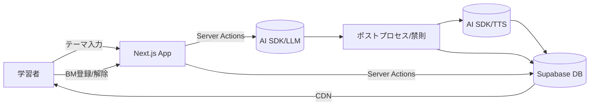
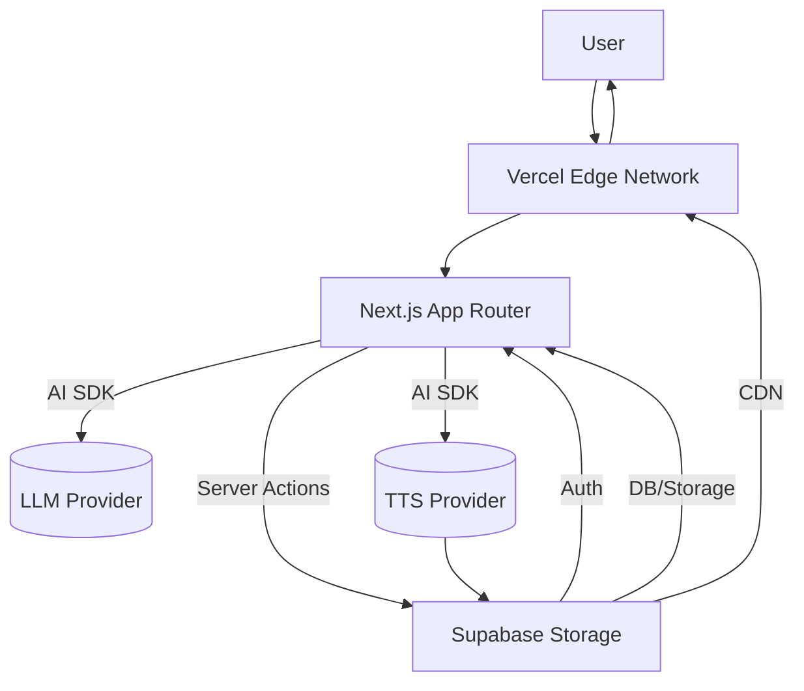
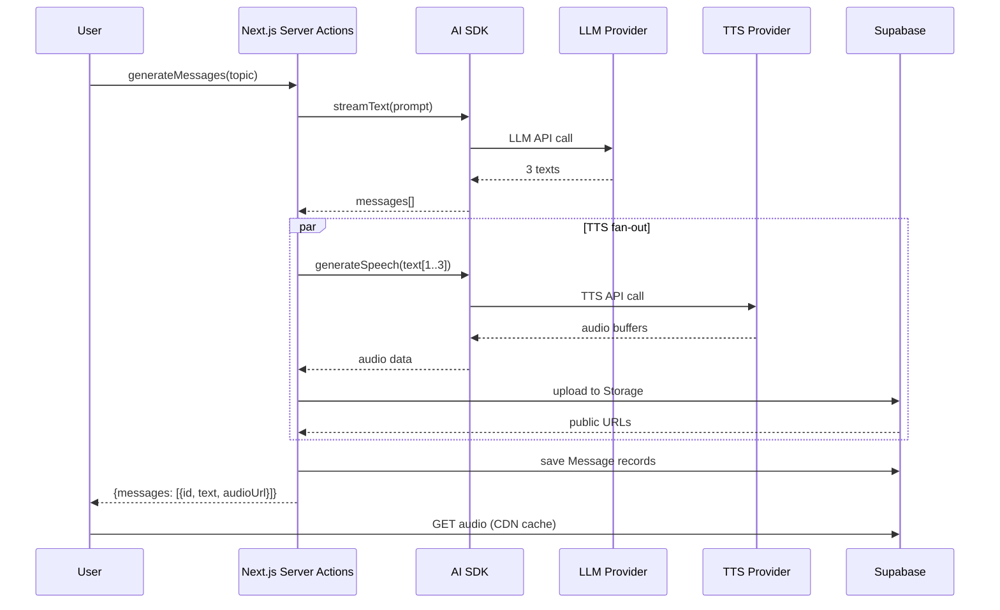

以下は、頂いたシステム概要を起点に自動展開した**要件定義＋クラウドアーキ設計の初稿（50枚相当の凝縮版）**です。
未確定は**Assumption**で明示し、最後に**Issue Radar**と**優先質問**を付けています。必要に応じてこのままPowerPointへ展開可能な粒度で記述しています。

---

### 0. 概要→要件マッピング（要約）

| 観点              | 概要テキストから読み取れる事実 | 要件カテゴリ      |
| --------------- | --------------- | ----------- |
| 3つの別バブル返信       | 1リクエスト→3候補生成    | 機能/性能       |
| 音声アイコン→発音再生     | TTS必須、音声キャッシュ   | 機能/外部IF/性能  |
| ブックマークアイコン      | 登録/一覧/検索/解除     | 機能/データ/画面   |
| 削除は確認モーダル       | 取消/確認UI/可用性     | 画面/UX/テスト   |
| 「今後も学べる英語一覧」    | 永続化・タグ/復習導線     | データ/UX      |
| 「AIからメッセージが来た際」 | LLM/プロンプト/安全策   | 外部IF/セキュリティ |

---

## 1. はじめに（目的/位置づけ/用語/進め方）

**目的**：英語学習者が提示した学習テーマに対し、AIが**3つの学習メッセージ**を返し、**発音音声**と**ブックマーク**で反復学習できる体験を、**モバイル/ブラウザ**で提供。

**技術スタック**

* **フロントエンド/バックエンド**：Next.js（App Router、Server Actions）
* **認証/データベース/API**：Supabase（認証、PostgreSQL、Realtime、Storage）
* **AI統合**：Vercel AI SDK（LLM/TTS統合）
* **デプロイ/ホスティング**：Vercel（Edge Network、Serverless Functions）
* **音声生成**：TTS API（Vercel AI SDK経由、または直接統合）

**用語（抜粋）**

* バブル：1件の学習メッセージ（テキスト＋音声再生＋ブックマークUI）
* ブックマーク：学習メッセージを後学習用に保存したレコード
* TTS：Text-to-Speech、発音音声の生成API
* LLM：Large Language Model（Vercel AI SDK経由で統合）
* Server Actions：Next.jsのサーバーサイドアクション（APIルート不要でデータ操作）

**進め方**：MoSCoW優先度で機能を段階投入（MVP→拡張）。要件⇄Server Actions/DB⇄テストをトレース。

---

## 2. スコープ/非スコープ

**In**：テーマ入力→AI 3案生成、発音音声、ブックマークCRUD、履歴/一覧、基本検索、Web/モバイルWeb、ユーザ登録/認証、管理画面（簡易）。
**Out（初期）**：学習計画自動生成、SRS間隔最適化、SNS共有、アプリ配信（ネイティブ）、多言語UI、オフライン再生（DL）。

---

## 3. ペルソナ/ユースケース

**ペルソナ**

* P1 学習者：社会人/学生、スマホ中心、スキマ学習
* P2 管理者：不適切コンテンツ監視、通報対応、辞書/NGワード管理

**ユースケース（要点）**

1. テーマ入力→AIが**3バブル**生成（自動）
2. 各バブル：**再生**（TTS）/ **ブックマーク**（登録/解除）
3. ブックマーク一覧：検索/タグ/再生/削除（確認モーダル必須）
4. 管理：通報審査/凍結、NG語辞書

---

## 4. 業務フロー（As-Is/To-Be）

**To-Be（要点）**

* 入口：自由入力 or 例題テンプレ
* 生成：LLM→ポストプロセス（長さ/レベル/禁則）→3案
* 音声：TTS同期生成（短文）＋CDNキャッシュ
* 復習：ブックマーク一覧→再生→タグ/完了チェック

---

## 5. 機能要件（抜粋：仕様/受入/例外/権限）

| ID     | 説明             | 受入条件(要点)               | 優先 | 依存            | 権限/例外                        |
| ------ | -------------- | ---------------------- | -- | ------------- | ---------------------------- |
| FR-001 | テーマ入力→3メッセージ生成 | 入力→≤3sで3件表示(P95)、NG語除去 | M  | LLM/TTS/Cache | 学習者/エラー:LLM失敗時はリトライ+案縮退(≤1件) |
| FR-002 | メッセージ再生        | クリック→≤300ms開始(P95)     | M  | TTS/CDN       | 匿名不可                         |
| FR-003 | ブックマーク登録       | 重複禁止、成功トースト            | M  | DB/ID連携       | 401/409適切                    |
| FR-004 | ブックマーク一覧       | ページング/検索/タグ            | M  | DB/Index      |                              |
| FR-005 | ブックマーク削除       | 確認モーダル→削除　取消可          | M  | DB            |                              |
| FR-006 | 履歴（直近50）       | 直近照会/再生成               | S  | DB            |                              |
| FR-007 | 通報/管理          | NG語辞書/凍結               | S  | Admin         | RBAC必須                       |

**Server Actions / API I/O（例）**

* `generateMessages(topic, level?)` → `{messages:[{id,text,audioUrl?,tags[]}]}`（Server Action）
* `createBookmark(messageId)` → `{id, ...}`（Server Action）
* `getBookmarks(q?, tag?, page?)` → `{bookmarks[], total}`（Server Action）
* `deleteBookmark(id, confirm)` → `void`（confirm未指定はエラー、Server Action）
* 認証：Supabase Auth（`createClient()`でクライアントサイド、Server Actionsでサーバーサイド）

---

## 6. 非機能要件（16分類：初期目標値）

| 区分               | 目標/測定/根拠（要点）                                                  |
| ---------------- | ------------------------------------------------------------- |
| 1 ユーザビリティ        | 3タップ以内で再生/保存。NPS≥40。モーダルで破壊操作確認。                              |
| 2 開発方式           | Trunk-based＋PRレビュー≥1名。静的解析/脆弱性スキャンCI必須（GitHub Actions + Vercel自動デプロイ）。                       |
| 3 規模             | 10k MAU/1k DAU/Peak同時200/QPSpeak=10。月成長20%。                   |
| 4 性能             | 生成完了P95≤3.0s（短文/キャッシュ活用）、再生開始P95≤300ms、Server Actions P95≤150ms。         |
| 5 信頼性            | 可用性≥99.9%（月間）。Server Actions MTTR≤30m。TTS/LLM障害時は縮退(キャッシュ/既存例文、AI SDK経由でプロバイダ切替)。         |
| 6 拡張性            | 水平スケール(Vercel Serverless Functions自動スケール)。TTS/LLM抽象化（Vercel AI SDKでプロバイダ差替可）。                         |
| 7 上位互換性          | ブラウザES2022/モバイルSafari/Chrome最新-1サポート。                         |
| 8 中立性            | ベンダロック低減(標準PostgreSQL/Supabase、標準HTTP/Next.js、Vercel AI SDKでプロバイダ抽象化)。代替TTS/LLM定義（AI SDK対応プロバイダ切替容易）。              |
| 9 BCP/DR         | RPO≤1h/RTO≤1h。Supabase自動バックアップ（PITR）、Vercelデプロイ履歴保持。                   |
| 10 セキュリティ        | Supabase Auth（OAuth2.1/OIDC）、Row Level Security（RLS）でRBAC、At-Rest（Supabase自動暗号化）/In-Transit TLS1.2+（Vercel Edge自動）、PII最小化。 |
| 11 稼働環境          | Vercel（Edge Network、グローバルCDN）/Supabase（マルチリージョン）/モバイルWeb対応。                                     |
| 12 可観測性          | 収集：Vercel Analytics（ログ/メトリクス）、Supabase Dashboard（DB/Storage）、カスタムログ。保持90日(PIIマスク)。SLI：レイテンシ/エラー率/音声生成失敗率。        |
| 13 テスト           | E2E（Playwright）、Server Actions単体テスト、負荷(100→500rps ramp、Vercel Edge負荷分散)、カナリア（Vercel Preview Deployments）。               |
| 14 移行            | 初期データ不要。将来：タグ体系移行手順定義。                                        |
| 15 教育            | 運用Runbook/管理画面操作手順/障害訓練四半期。                                   |
| 16 運用保守          | SLO:可用性99.9/再生P95≤300ms。変更管理：週次定例/変更審査。                       |

---

## 7. データ要件（論理/保持/監査）

**主エンティティ（論理）**

* User(id, email, locale, role)
* Message(id, text, topic, level, createdAt, providerMeta)
* Audio(id, messageId, url, voice, format, durationSec, hash)
* Bookmark(id, userId, messageId, tags[], createdAt)
* AbuseReport(id, targetType, targetId, reason, status)
* AuditLog(id, actor, action, target, ts, ip)

**保持/マスキング**

* PII最小保持。メールはハッシュ検索可。ログはIP末尾マスク。
* 保持：Bookmark/Message=無期限（ユーザ要求で削除可）、Rawログ90日、集計1年。

---

## 8. 画面要件（主要UI/アクセシビリティ）

* 画面：①テーマ入力 ②3バブル結果 ③ブックマーク一覧 ④設定（音声/速度） ⑤管理
* A11y：キーボード操作、音声ボタンに`aria-label="発音再生"`, コントラスト比≥4.5。
* 対応：Chrome/Safari/Firefox/Edge 最新-1、iOS/Android最新-1。

---

## 9. 外部インタフェース一覧

| 連携先          | 方向  | 方式           | 頻度  | フォーマット     | SLA   | 実装方式                |
| ------------ | --- | ------------ | --- | ---------- | ----- | ------------------ |
| LLM          | 双方向 | Vercel AI SDK | 随時  | JSON       | 99.9% | Server Actions経由    |
| TTS          | 送受  | Vercel AI SDK | 随時  | JSON/Audio | 99.9% | Server Actions経由    |
| Supabase Auth | 双方向 | REST/JWT     | 認証時 | JWT        | 99.95%| `@supabase/ssr`      |
| Supabase DB   | 双方向 | PostgREST    | 随時  | JSON       | 99.9% | Server Actions + Client |
| Supabase Storage | 送受 | REST        | 随時  | 音声ファイル     | 99.9% | Server Actions経由    |
| Vercel Edge  | 配信  | HTTPS        | 常時  | 静的/動的      | 99.9% | 自動CDN             |

---

## 10. テスト方針（受入/設計技法）

* **受入例**：FR-001 3件生成／P95≤3s／禁則適用／異常時縮退。
* **設計技法**：同値/境界（入力長0/1/140/…）、原因結果（NG語→置換/拒否）、決定表（削除確定/取消）。
* **負荷**：Peak QPS=10（Assumption）→余裕2倍設計、音声キャッシュ効果測定。

---

## 11. 運用・SRE

* **SLI/SLO**：Server Actionsレイテンシ/エラー率（Vercel Analytics）、音声再生開始P95、生成失敗率<0.5%。
* **監視→アラート→Runbook**：Vercel Analytics + Supabase Dashboard、LLM/TTS失敗率>1%（5分）→AI SDK経由でプロバイダ切替/キャッシュ強制。
* **バックアップ**：Supabase自動バックアップ（PITR）、Storageバージョニング。
* **RPO/RTO**：≤1h/≤1h（Supabaseバックアップ + Vercelデプロイロールバック）。

---

## 12. セキュリティ

* **認証/認可**：Supabase Auth（OIDC/OAuth2.1準拠）＋短命トークン、Row Level Security（RLS）でRBAC（User/Admin）。
* **暗号化**：At-Rest（Supabase自動暗号化）、In-Transit（TLS1.2+、Vercel Edge自動）。
* **鍵管理**：Vercel環境変数（暗号化）、Supabase Secrets。
* **脅威対策**：Vercel Edge Configレート制限、プロンプトインジェクション対策（AI SDK経由でサニタイズ/システムプロンプト固定）、Supabase監査ログ。

---

## 13. 体制・RACI/スケジュール（初期）

| 項目    | R   | A      | C       | I     |
| ----- | --- | ------ | ------- | ----- |
| 要件確定  | BA  | PO     | Eng/QA  | Stake |
| アーキ決定 | SA  | PO     | Sec/Dev | Ops   |
| 実装    | Eng | EngMgr | QA      | PO    |
| 受入    | QA  | PO     | BA      | Stake |

**計画（目安）**：M0要件、M1-M2実装、M3β、M4本番。

---

## 14. リスク/未決/前提

| ID    | 事象             | 影響     | Mitigation         |
| ----- | -------------- | ------ | ------------------ |
| RS-01 | LLM/TTS外部SLA依存 | 可用性/体験 | キャッシュ/多プロバイダ抽象化/縮退 |
| RS-02 | 音声コスト増         | 粗利悪化   | 文字数制御/合成再利用/事前生成   |
| RS-03 | 未成年利用/法務       | 規約/保存  | 年齢同意/リーガルレビュー      |

---

## 15. 別紙（抜粋）

* 機能一覧、外部IF仕様、画面一覧、運用台帳（テンプレ同梱想定）

---

# C. インフラ構成アーキ（推奨＋代替）

### 推奨（Next.js + Supabase + Vercel）

* **フロントエンド/バックエンド**：Next.js（App Router、Server Actions、SSR/SSG）
* **認証/データベース**：Supabase（PostgreSQL、Row Level Security、Realtime）
* **ストレージ**：Supabase Storage（音声ファイル、CDN配信）
* **デプロイ/ホスティング**：Vercel（Edge Network、Serverless Functions、自動スケール）
* **AI統合**：Vercel AI SDK（LLM/TTSプロバイダ抽象化）
* **CI/CD**：GitHub Actions → Vercel自動デプロイ
* **監視**：Vercel Analytics + Supabase Dashboard + カスタムログ

**シーケンス：テーマ→3案生成→音声（Server Actions使用）**

### NFR適合（要点）

* 冗長：Vercel Edge Network（グローバル分散）、Supabase（マルチリージョン対応）
* スケール：Vercel自動スケール（Serverless Functions）、Supabase自動スケール、Edge Networkキャッシュヒット率>90%目標
* セキュリティ：Vercel Edge Config、Supabase Row Level Security、環境変数管理、レート制限（Vercel Pro以上）
* DR：Supabase自動バックアップ（PITR）、Vercelデプロイ履歴保持

### コスト概算

**前提**：10k MAU/1k DAU、1日2リクエスト/DAU、1リクエスト=3バブル（平均100文字/バブル）

* 月間バブル数 ≈ 1k×2×30×3 = **180k**
* TTS文字数 ≈ 180k×100 = **18M chars**
* Server Actions実行 ≈ 60k req/月（生成）+ 180k req/月（ブックマーク等）≈ **240k executions**

| リソース            | 概算             | 式/前提                                |
| --------------- | -------------- | ----------------------------------- |
| Vercel Pro      | $20            | 固定料金（Hobby $0、Pro $20/月）            |
| Vercel Functions | $0–50          | 240k executions（無料枠内または超過分）        |
| Supabase Pro    | $25            | 固定料金（Free $0、Pro $25/月）             |
| Supabase DB     | $0–30          | 10GBストレージ、50GB転送（無料枠内または超過分）    |
| Supabase Storage | $0–20          | 100–300GB音声ファイル（無料枠内または超過分）      |
| TTS             | $200–600       | 18M chars × 単価（ベンダ依存）               |
| LLM             | $150–500      | 3出力/req × 60k req/月 × 単価            |
| 監視/ログ           | $0–20          | Vercel Analytics（Pro含む）、Supabase Dashboard |
| **合計**          | **$395–1,265** | 変動大（TTS/LLM単価に強依存、初期は$400–600想定）  |

**最適化案**：①短文方針/文字数制御 ②音声キャッシュ＆再利用キー（text+voice+speedのhash）③Server Actionsでのキャッシュ活用（`unstable_cache`）④Supabase Storage CDN TTL延長 ⑤Vercel Edge Configで設定管理。

### 代替案×2

1. **Next.js + AWS Amplify + RDS**

   * 長：AWS統合、既存インフラ活用
   * 短：Supabaseの開発体験/Realtime機能が使えない、セットアップ複雑
2. **Next.js + PlanetScale + Clerk Auth**

   * 長：PlanetScaleのスケーラビリティ、Clerkの認証機能
   * 短：ストレージ別途必要、コスト上振れしやすい

**切替容易性**：
* TTS/LLMは**Vercel AI SDK**で抽象化（同一I/F、プロバイダ切替容易）
* DBは標準PostgreSQL（Supabase→RDS等への移行可能）
* Server ActionsはNext.js標準機能（フレームワーク依存）
* 認証はSupabase Auth（OAuth2.1/OIDC準拠、他IdPへの切替可能）

---

# 要求⇄機能⇄API/DB⇄テスト（トレース抜粋）

| 要求    | 機能ID     | Server Action / API          | DB（Supabase） | 受入テスト       |
| ----- | -------- | -------------------------- | ----------- | ----------- |
| 3案提示  | FR-001   | `generateMessages()`        | Message     | 3件/≤3s/P95  |
| 発音再生  | FR-002   | Supabase Storage CDN        | Audio       | 再生開始≤300ms  |
| 保存/解除 | FR-003/5 | `createBookmark()` / `deleteBookmark()` | Bookmark    | 重複禁止/確認モーダル |
| 一覧/検索 | FR-004   | `getBookmarks()`            | Bookmark    | ページング/検索一致  |

---

# D. Issue Radar（自動抽出）

| ID    | 区分      | 事象                     | 業務影響      | 推奨アクション                | 期限    | 担当  | 優先 |
| ----- | ------- | ---------------------- | --------- | ---------------------- | ----- | --- | -- |
| IR-01 | 非機能/性能  | **P95 3s**根拠未確定（文長/回数） | 体感遅延      | **POC負荷試験**（LLM/TTS混在） | M0+2w | SRE | H  |
| IR-02 | データ/コスト | **TTS文字数**不定→コスト振れ     | 予算超過      | 文字数上限/短文化ガイド           | M0+2w | PO  | H  |
| IR-03 | セキュリティ  | 児童/未成年条項・保存年限未定        | 法務リスク     | **リーガル確認**(規約/年齢同意)    | M0+3w | 法務  | H  |
| IR-04 | 機能/UX   | ブックマーク検索軸（タグ/全文）未定     | 回遊/復習効率低下 | **WS**で検索要件合意          | M0+2w | BA  | M  |
| IR-05 | 外部IF    | LLM/TTS代替可否/優先順位不明（AI SDK対応プロバイダ） | 障害時縮退不可   | Provider評価**ベンチ**（OpenAI/Anthropic/Google等） | M0+3w | SA  | H  |
| IR-06 | 運用      | 監視しきい値/Runbook詳細未      | 復旧遅延      | 監視指標とRunbook整備         | M1    | SRE | M  |
| IR-07 | 法規      | 個人データ国外移転有無不明          | コンプラ     | データ所在/越境確認             | M0+2w | 法務  | H  |

---

## 優先質問（不明点を上から順に解消）

1. **ターゲット文量/難易度**：1バブル平均文字数/語彙レベル（CEFR等）は？（性能・コスト直結）
2. **DAU/ピーク**：初期と6か月後の利用規模目標？（スケール/コスト設計）
3. **音声要件**：声種/速度/感情、再生の**自動 vs クリック**規約方針？（A11y/自動再生制限）
4. **検索要件**：ブックマークの検索軸（全文/タグ/レベル/日付/既学習フラグ）と並び順は？
5. **法務/年齢**：未成年利用の可否、規約/同意フロー、データ保存年限/国外移転の可否？
6. **LLM/TTS選定方針**：Vercel AI SDK対応プロバイダ（OpenAI/Anthropic/Google等）のコスト/品質/データ扱いの優先順位と第2候補は？
7. **多言語/音声品質**：英語以外の将来拡張（JP→ENの双方向など）の前提は？
